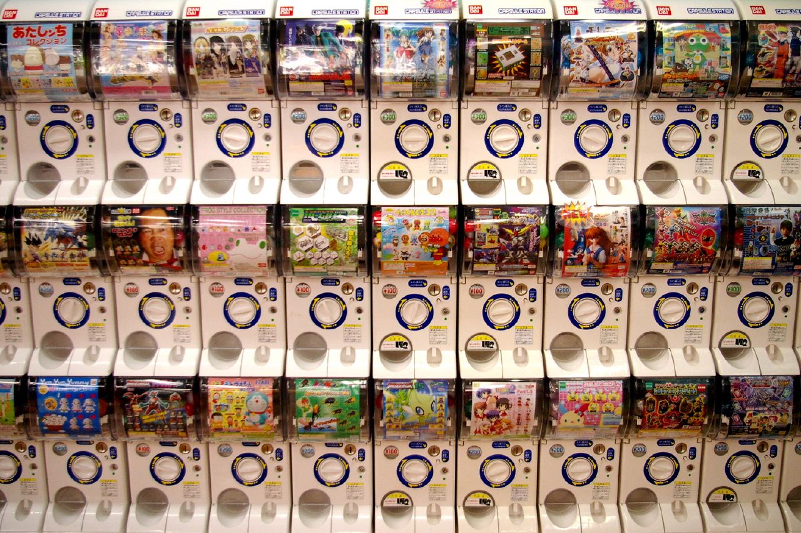

# People over Process, Feelings over Hype

Ian Whitney
Academic Support Resources (Office of Undergrad Education)
whit0694@umn.edu / `ian_whitney` on Slack

---

## Let's talk about therapy

^ ### Way therapy is portrayed

---

# I Have A Problem

[.footer: Photo by Charles Deluvio on Unsplash]

---

# [Wise Insight]

[.footer: Photo by Alexandru Rotariu on Unsplash]

---

# All my problems are solved!

[.footer: Photo by Bruce Galpin on Unsplash]

---

[.footer: https://www.flickr.com/photos/tim__omeara/476398294/]

^ ### Therapy is portrayed as a process
^ Defined inputs, defined outputs
^ Turn the cogs and out pops the result
^ You're not doing work, it just _happens_

---

### Way therapy works (for me)

---

# I Have A Problem

[.footer: Photo by Charles Deluvio on Unsplash]

---

# Hmm. Let's talk about that

[.footer: Photo by Alexandru Rotariu on Unsplash]

---

[.footer: Photo by Gaelle Marcel on Unsplash]

^ [months of hard work pass]

---

# I feel slightly better.
## And I'm exhausted.
## And now I have new problems.

[.footer: Photo by Charles Deluvio on Unsplash]

---

# Repeat Forever

[.footer: Photo by Jorgen Hendriksen on Unsplash]

---

[.footer: https://www.flickr.com/photos/tim__omeara/476398294/]

^ This is not what therapy is for me
^ it's not a process

---

[.footer: https://www.flickr.com/photos/tokyoknock/9382842]

^ it's _people_
^ it's a wall of Japanese gachapon machines
^ Random inputs, unexpected outputs
^ You never get the same toy twice

---

[.footer: Photo by FLOUFFY on Unsplash]

# We are lazy

- Process is easy
- People are hard

---

[.footer: Photo by Nikita Kachanovsky on Unsplash]

# Agile

> **Individuals and interactions** over processes and tools

^ 2001
^ 17 developers, all dudes
^ This was their top declaration
^ Emphasis theirs

---

[.footer: https://www.flickr.com/photos/tim__omeara/476398294/]

^ This is Process and tools

---

[.footer: https://www.flickr.com/photos/tokyoknock/9382842]

^ This is Individuals and Interactions

---

# Programming is _people_

---

### What people heard

> Hey, let's do what those 12 white guys who were hunkered down at an expensive ski lodge were doing!

https://www.flickr.com/photos/pancholp/6344747100

---

### Programming, circa 2005

- I have a problem
- XP
- All my problems are solved!

---

### Which, we know how that works

- The practices that worked for one set of people at Chrysler will never work for your set of people at your company

---

### And we've certainly learned that lesson by now

### Programming, circa 2020

- I have a problem
- Kubernetes
- All my problems are solved!

---

### Feelings over Hype

Because we're all random inputs and unexpected outputs
What worked for [insert company here] may not work for you
Your problems are different
Your team is different
Your solutions will be different
If a solution doesn't feel right, don't use it.

---

### What pain does X solve

---

### Do I feel that pain?

---

### What does their solution require?

---

### Do I have those tools?

---

### Revisit, Iterate, Abandon
